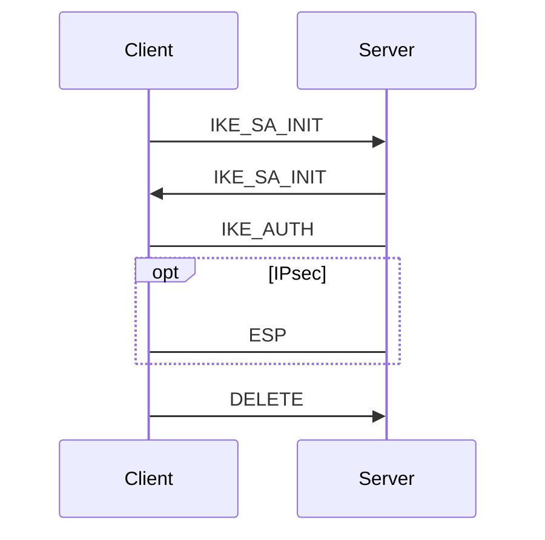

## 概述

- IPsec
	- 使用 UDP
	- 用於保護兩個節點之間的資料傳輸。
	- 在開始傳輸之前需要先進行資料交換和身份驗證，而實作方法常見的有 L2TP 或 IKEv2，因此組合通常是 L2TP/IPsec 或 IKEv2/IPsec
	- 為對等連接，但一般來說還是會分為伺服端和客戶端。
- IKEv2
	- 分為兩步
		- 第一步是兩個節點會協商出保護第二步的密碼
		- 第二步會開始進行身份驗證，這裡的封包都是加密的，並且會協商出 IPsec 用的密鑰。
	- 可以同時保證機密性和完整性，也就是說傳輸的資料有加密並且有認證。
	- 身份驗證有許多方式可以選擇
		- `PSK` 需要兩個節點事先共享一個密鑰
			- 缺點：無法做到每個使用者不同密碼、中間人攻擊
		- `PKI` 使用憑證做為認證。這個方法是最安全的方式
			- 缺點：需要先有 PKI，因此還需要有 CA 等等的角色
		- `EAP` IKEv2 本身有實作出幾個簡單的 EAP，可以做到帳號密碼登入的功能
		- `RADIUS` 由第三方伺服器認證

## 封包
- 發起連線的那一端稱為客戶端，而被連接端則稱為伺服端。
- IKEv2
	1. 客戶端先發起 `IKE_SA_INIT`
		- 包含第一階段密鑰交換的算法等。
	2. 伺服器回覆 `IKE_SA_INIT`
		- 包含選擇的算法和身份驗證訊息等。
		- 如果客戶端選擇的算法不支援，則會在發起自己支援的算法，相當於回到了第一步。
	3. 客戶端回覆 `IKE_AUTH`
		- 這裡可能會來回幾次，取決於身份驗證方式
	4. 身份驗證完成開始通訊
	5. 客戶端通要斷開連接，因此發起 `DELETE`
		- `DELETE` 代表手動斷開，如果是網路斷線伺服器保留一段時間才 release



## strongSwan 實際封包紀錄講解
- XXX.XXX.XXX.XXX 為客戶端 IP
- 172.21.0.2 為伺服器 IP
- 下方的 `IKE_SA_INIT` 由於客戶端所選的算法不支援，因此會多一步
- 除錯必會

```=
客戶端發起 IKE_SA_INIT
06[NET] received packet: from XXX.XXX.XXX.XXX[38569] to 172.21.0.2[500] (948 bytes)
06[ENC] parsed IKE_SA_INIT request 0 [ SA KE No N(NATD_S_IP) N(NATD_D_IP) N(FRAG_SUP) N(HASH_ALG) N(REDIR_SUP) ]
06[IKE] XXX.XXX.XXX.XXX is initiating an IKE_SA
客戶端選擇的身份驗證階段加密演算法
06[CFG] selected proposal: IKE:CHACHA20_POLY1305/PRF_HMAC_SHA2_512/MODP_4096
06[IKE] remote host is behind NAT
伺服端不支援
06[IKE] DH group ECP_256 unacceptable, requesting MODP_4096
伺服器於閘道器後面，需要維持通道開啟
06[IKE] local host is behind NAT, sending keep alives
回覆 IKE_SA_INIT
06[ENC] generating IKE_SA_INIT response 0 [ N(INVAL_KE) ]
06[NET] sending packet: from 172.21.0.2[500] to XXX.XXX.XXX.XXX[38569] (38 bytes)
--
客戶端回覆 IKE_SA_INIT
13[NET] received packet: from XXX.XXX.XXX.XXX[38569] to 172.21.0.2[500] (1396 bytes)
13[ENC] parsed IKE_SA_INIT request 0 [ SA KE No N(NATD_S_IP) N(NATD_D_IP) N(FRAG_SUP) N(HASH_ALG) N(REDIR_SUP) ]
表示客戶端開始準備身份驗證
13[IKE] XXX.XXX.XXX.XXX is initiating an IKE_SA
客戶端選擇的身份驗證階段加密演算法
13[CFG] selected proposal: IKE:CHACHA20_POLY1305/PRF_HMAC_SHA2_512/MODP_4096
13[IKE] local host is behind NAT, sending keep alives
13[IKE] remote host is behind NAT
由於使用了憑證身份驗證，因此伺服器發送憑證請求
13[IKE] sending cert request for "C=TW, O=TEST, CN=TEST Root CA Cert"
13[IKE] sending cert request for "C=TW, O=TEST, CN=test.com"
13[ENC] generating IKE_SA_INIT response 0 [ SA KE No N(NATD_S_IP) N(NATD_D_IP) CERTREQ N(FRAG_SUP) N(HASH_ALG) N(CHDLESS_SUP) N(MULT_AUTH) ]
回覆 IKE_SA_INIT
13[NET] sending packet: from 172.21.0.2[500] to XXX.XXX.XXX.XXX[38569] (761 bytes)
--
客戶端回覆 IKE_AUTH
06[NET] received packet: from XXX.XXX.XXX.XXX[41984] to 172.21.0.2[4500] (1368 bytes)
06[ENC] parsed IKE_AUTH request 1 [ EF(1/2) ]
伺服器開啟封包分段，因此這裡的封包被拆成兩節 
06[ENC] received fragment #1 of 2, waiting for complete IKE message
11[NET] received packet: from XXX.XXX.XXX.XXX[41984] to 172.21.0.2[4500] (1107 bytes)
11[ENC] parsed IKE_AUTH request 1 [ EF(2/2) ]
11[ENC] received fragment #2 of 2, reassembled fragmented IKE message (2410 bytes)
11[ENC] parsed IKE_AUTH request 1 [ IDi CERT N(INIT_CONTACT) CERTREQ AUTH CPRQ(ADDR ADDR6 DNS DNS6) SA TSi TSr N(MOBIKE_SUP) N(NO_ADD_ADDR) N(MULT_AUTH) N(EAP_ONLY) N(MSG_ID_SYN_SUP) ]
客戶端的憑證請求
11[IKE] received cert request for "C=TW, O=TEST, CN=TEST Root CA Cert"
收到客戶端的終端憑證，並且開始驗證
11[IKE] received end entity cert "CN=Zenfone 8, C=TW, O=TEST"
11[CFG] looking for peer configs matching 172.21.0.2[%any]...XXX.XXX.XXX.XXX[CN=Zenfone 8, C=TW, O=TEST]
11[CFG] selected peer config 'rw-pki'
11[CFG]   using certificate "CN=Zenfone 8, C=TW, O=TEST"
11[CFG]   using trusted ca certificate "C=TW, O=TEST, CN=TEST Root CA Cert"
11[CFG]   reached self-signed root ca with a path length of 0
11[CFG] checking certificate status of "CN=Zenfone 8, C=TW, O=TEST"
11[CFG]   fetching crl from 'https://test.com.tw' ...
11[CFG]   using trusted certificate "C=TW, O=TEST, CN=TEST Root CA Cert"
11[CFG]   crl correctly signed by "C=TW, O=TEST, CN=TEST Root CA Cert"
11[CFG]   crl is valid: until Aug 13 04:42:29 2024
11[CFG] certificate status is good
11[IKE] authentication of 'CN=Zenfone 8, C=TW, O=TEST' with RSA_EMSA_PKCS1_SHA2_384 successful
11[IKE] peer supports MOBIKE
11[IKE] authentication of 'test.ddns.net' (myself) with RSA_EMSA_PKCS1_SHA2_384 successful
傳送伺服器終端憑證給客戶端
11[IKE] sending end entity cert "CN=test.ddns.net, C=TW, O=TEST"
11[IKE] peer requested virtual IP %any
11[CFG] assigning new lease to 'CN=Zenfone 8, C=TW, O=TEST'
11[IKE] assigning virtual IP 192.168.10.1 to peer 'CN=Zenfone 8, C=TW, O=TEST'
11[IKE] peer requested virtual IP %any6
11[IKE] no virtual IP found for %any6 requested by 'CN=Zenfone 8, C=TW, O=TEST'
11[IKE] IKE_SA rw-pki[2] established between 172.21.0.2[test.ddns.net]...XXX.XXX.XXX.XXX[CN=Zenfone 8, C=TW, O=TEST]
11[IKE] scheduling rekeying in 13294s
11[IKE] maximum IKE_SA lifetime 14734s
選擇 IPsec 加密演算法
11[CFG] selected proposal: ESP:CHACHA20_POLY1305/NO_EXT_SEQ
11[IKE] CHILD_SA rw-pki{1} established with SPIs c0c55b76_i 96945922_o and TS 0.0.0.0/0 === 192.168.10.1/32
11[ENC] generating IKE_AUTH response 1 [ IDr CERT AUTH CPRP(ADDR) SA TSi TSr N(MOBIKE_SUP) N(NO_ADD_ADDR) ]
11[ENC] splitting IKE message (2181 bytes) into 2 fragments
回覆 IKE_AUTH
11[ENC] generating IKE_AUTH response 1 [ EF(1/2) ]
11[ENC] generating IKE_AUTH response 1 [ EF(2/2) ]
11[NET] sending packet: from 172.21.0.2[4500] to XXX.XXX.XXX.XXX[41984] (1248 bytes)
11[NET] sending packet: from 172.21.0.2[4500] to XXX.XXX.XXX.XXX[41984] (998 bytes)
--
開始 IPsec 通訊
07[NET] received packet: from XXX.XXX.XXX.XXX[41984] to 172.21.0.2[4500] (65 bytes)
07[ENC] parsed INFORMATIONAL request 2 [ D ]
--
客戶端請求斷開
07[IKE] received DELETE for IKE_SA rw-pki[2]
07[IKE] deleting IKE_SA rw-pki[2] between 172.21.0.2[test.ddns.net]...XXX.XXX.XXX.XXX[CN=Zenfone 8, C=TW, O=TEST]
07[IKE] IKE_SA deleted
07[ENC] generating INFORMATIONAL response 2 [ ]
07[NET] sending packet: from 172.21.0.2[4500] to XXX.XXX.XXX.XXX[41984] (57 bytes)
07[CFG] lease 192.168.10.1 by 'CN=Zenfone 8, C=TW, O=TEST' went offline
```

## 參考資料


